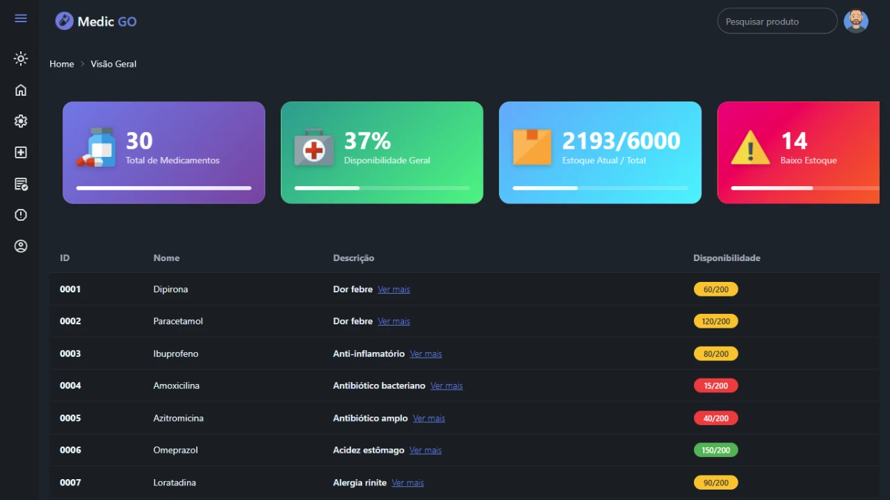

# 💊 Medic GO

O **Medical Go** é uma aplicação web desenvolvida para **gestão e pesquisa inteligente de medicamentos**, com foco em organização, desempenho e arquitetura reativa pensado diretamente para um sistema dinâmico para estoques de drogarias e farmácias.  

O sistema permite visualizar, filtrar e gerenciar medicamentos de forma rápida, clara e eficiente.

## 🚀 Funcionalidades

- 📦 Listagem de medicamentos a partir de dados estruturados (JSON / mock)
- 🔍 **Sistema de pesquisa em tempo real**
- 📊 Visualização de informações como ID, nome, descrição e quantidade
- 🧠 Arquitetura preparada para futuras integrações (API, banco de dados, IA)
- 🌙 Interface moderna e organizada

## 🔍 Funcionalidade de Pesquisa (Search)

O **Medical Go** possui um sistema de busca reativo e desacoplado entre componentes, garantindo performance e boa organização do código.

### ✅ Comportamento da Pesquisa

- Input de pesquisa no componente **Search** detecta mudanças em **tempo real**
- Filtro atua simultaneamente sobre:
  - ID
  - Nome
  - Descrição
  - Quantidade
- Busca **case-insensitive**
- Campo de pesquisa vazio retorna **todos os medicamentos**
- Itens que não correspondem ao termo são removidos da visualização
- Apenas resultados relevantes permanecem na tela

## 🛠️ Tecnologias Utilizadas

- **Framework:** Angular
- **Linguagem:** TypeScript
- **Reatividade:** RxJS
- **Estilização:** Tailwind CSS / CSS
- **Dados:** JSON (mock)
- **Build Tool:** Angular CLI
